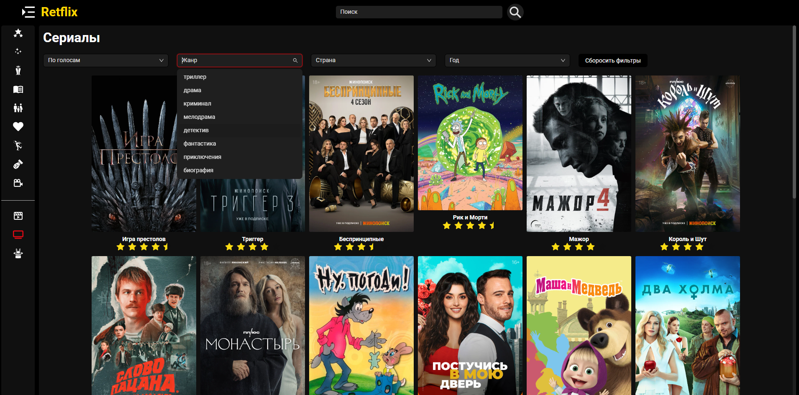
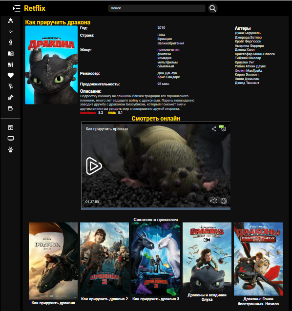

# Retflix - [Онлайн кинотеатр](https://retflix-sigma.vercel.app/)

### Деплой:

[https://retflix-sigma.vercel.app/](https://retflix-sigma.vercel.app/)

### Технологии:

1. TypeScript
2. React
3. Mobx
4. SCSS
5. Antd
6. Axios
7. React Toastify
8. Framer-motion

### Установка и запуск:

1. Получите API-ключ на сайте [https://kinopoiskapiunofficial.tech/](https://kinopoiskapiunofficial.tech/)
2. npm install
3. Создайте файл .env в корне проекта и добавьте:
   - VITE_KINOPOISK_API_KEY = "Ваш API ключ"
   - VITE_KINIPOISK_BASE_URL = https://kinopoiskapiunofficial.tech/api/
4. npm run dev
